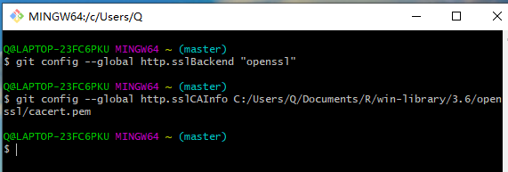
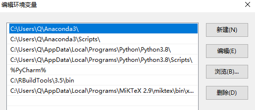
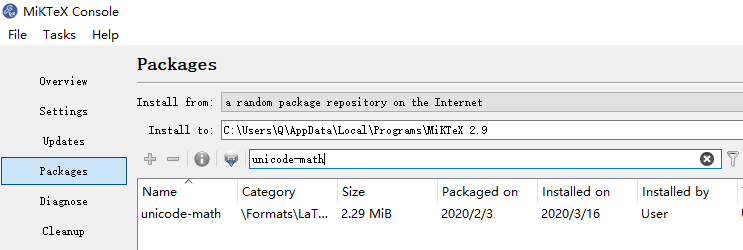

First,download the source file from [*Compile Hadley’s Advanced R to a PDF*](http://brettklamer.com/diversions/statistical/compile-hadleys-advanced-r-programming-to-a-pdf/). 
Second,install R Package dependencies using `devtools::install_github("hadley/sloop")` and `devtools::install_github("hadley/emo")`. 
Finanlly, use `bookdown::render_book("index.Rmd", output_format = "bookdown::pdf_book")` to compile the book.

The followings are the errors I've met and how I solved them.Some packages that must be installed during the compilation process may have been installed before and are not recorded.

## Missing Packages

Most of the warnings are packages missing. Use `install.packages()` to solve this kind of problem. The packages I installed during the process are *bookdown*,
*RSQLite*,*lobstr*,*profvis*,*bench*,*dbplyr*,*tinytex*,*rlang*,*devtools*,
*RCPP*.

## SSL/TLS connection failed

When I installed packages from github,I receiver this warning:
*Failed to install 'unknown package' from GitHub:*
*schannel: failed to receive handshake, SSL/TLS connection failed.*
To solve this problem,I Open the Git Bash window and replace my cacert.pem file path as shown below.

```{r}

```

## "xelatex" not Found

I installed *MiKTeX*,choosing"*Always install missing packages on-the-fly*" when *MiKTeX* let choose whether missing packages are to be installed.


```{r}

```

## Quitting from lines 223-235 (Introduciton.Rmd)

Adding `encoding = "UTF-8"` in line 224 can fix it. The line 224 is displayed as
```{r eval=FALSE}
contributors <- read.csv("contributors.csv", stringsAsFactors = FALSE,encoding = "UTF-8")
```

## In system(cmd) : 'make' not found

To solve this problem, I added *Rtools'* path in the system settings as the picture shown below.
```{r}

```

## LaTeX Error:File `unicode-math.sty' not found

I installed  *unicode-math.sty* in *miktex*.
```{r}

```

## Fonts can't be found

I installed two fonts  *"Inconsolata" and " AndaleMono"*.These two fonts are not packages in R, I downloaded them from the internet and copied it to `C:\Windows\Fonts`.

```{r}

```
